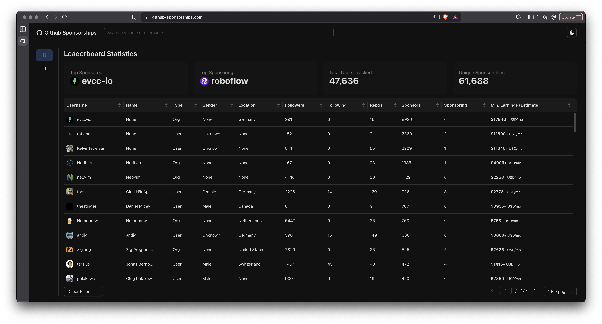

# FSE'26 Tool Documentation: Mapping GitHub Sponsors: A Data Collection Tool and Benchmark for Open-Source Sustainability Research



<p align="center">
  <a href="https://youtu.be/Wr2YlItWXvM" style="text-decoration: none; border: none;">
    
  </a>
  <a href="https://github-sponsorships.com/" style="text-decoration: none; border: none;">
    
  </a>
</p>


## 1. Overview

This document provides technical documentation for the backend component of the tool described in the paper, "Mapping GitHub Sponsors: A Data Collection Tool and Benchmark for Open-Source Sustainability Research" (submitted to The ACM International Conference on the Foundations of Software Engineering (FSE)).

The core of this tool is the `IngestWorker`, a continuous, long-running process designed to build and maintain a longitudinal dataset of the GitHub Sponsors ecosystem. It is responsible for the systematic collection, enrichment, and storage of sponsorship data, which in turn powers the analysis and dashboard features of the project.


## 2. Core Concepts

### Priority-Based Traversal

The worker uses a dynamic priority system (from 1 to 10) to decide which user to process next. A user's priority is adjusted after each processing cycle based on their connectivity:

-   **Increase Priority**: If new, unique users are discovered in the user's sponsorship relationships, their priority is increased by 1 (up to a max of 10). This focuses the crawler on expanding the known graph.
-   **Maintain Priority**: If only existing relationships are found, the priority remains unchanged.
-   **Decrease Priority**: If a user has no sponsorship connections, their priority is decreased by 1 (down to a min of 1), reducing the frequency of re-scraping isolated nodes.

### Data Seeding

On its first run, the worker performs a one-time **seeding operation**. It queries the GitHub API for all users who are marked as "Sponsorable" and adds them to the queue with a default priority. This populates the initial set of nodes from which the graph traversal begins.

### Data Enrichment

The worker enriches basic user profiles with additional data not readily available from a single API endpoint. This includes:

-   **Gender Inference**: Scrapes user-set pronouns via a headless browser. If unavailable, it falls back to an AI query to infer gender from the user's name.
-   **Location Normalization**: Parses free-form location strings and uses the OpenStreetMap API to resolve them to a standardized country.
-   **User Activity**: Collects historical contribution data for active users.

## 3. Usage

### 3.1. Prerequisites

-   Python 3.10+
-   PostgreSQL database
-   Git
-   An active internet connection

### 3.2. Configuration

The worker is configured via environment variables. Create a `.env` file in the project root by copying `.env.example` and filling in the following values:

| Variable      | Description |
| :------------ | :------------------------------------------------------------------------------------------------------ |
| `PAT`         | A GitHub Personal Access Token with `user` and `read:org` scopes.                                       |
| `host`        | The hostname of your PostgreSQL database.                                                               |
| `port`        | The port for your PostgreSQL database.                                                                  |
| `user`        | The username for your PostgreSQL database.                                                              |
| `password`    | The password for your PostgreSQL database.                                                              |
| `dbname`      | The name of the database to use.                                                                        |
| `email`       | An email for the User-Agent header in OpenStreetMap API requests.                                       |
| `API_KEY`     | Your OpenAI API key for the gender inference fallback.                                                  |
| `gh_username` | GitHub username for an account **without 2FA**. Required for scraping pronouns.                         |
| `gh_password` | GitHub password for the account above.                                                                  |

#### Ingest Worker

The worker is responsible for collecting and processing data. It is designed to be run as a long-running module from the project's root directory.

```bash
# Navigate to the project root
cd /path/to/Github-Sponsor-Dashboard

# Run the worker
python -m backend.ingest.worker
```

Log output will be printed to the console and saved to rotating log files in the `backend/logs/` directory.

#### Backend API Server

The Flask API serves the collected data to the frontend dashboard.

```bash
# From the project root
python backend/app.py
```

By default, the API will be available at `http://127.0.0.1:5000`.

#### Frontend Development Server

The React-based dashboard provides an interactive interface for exploring the data.

```bash
# Navigate to the frontend directory
cd frontend

# Install dependencies (only needs to be done once)
npm install

# Run the development server
npm run dev
```

The dashboard will typically be available at `http://localhost:5173` and will connect to the backend API.

### 3.3. Docker Deployment (Recommended)

The easiest way to deploy the entire application locally is using Docker Compose. This will set up the backend, frontend, and PostgreSQL database automatically.

#### Prerequisites

- Docker and Docker Compose installed on your system
- A `.env` file in the project root (copy from `.env.example`)

#### Quick Start

1. **Create environment file:**

```bash
cp .env.example .env
# Edit .env and fill in your configuration values
```

2. **Build and start all services:**

```bash
# Using docker-compose directly
docker-compose up -d

# Or using the Makefile (recommended)
make build
make up
```

This will:
- Start PostgreSQL database on port 5432
- Start backend API on port 5000
- Start frontend on port 3000
- Automatically initialize the database schema

3. **Access the application:**

- Frontend: http://localhost:3000
- Backend API: http://localhost:5000
- Database: localhost:5432

4. **View logs:**

```bash
# All services
docker-compose logs -f

# Specific service
docker-compose logs -f backend
docker-compose logs -f frontend
docker-compose logs -f db
```

5. **Stop services:**

```bash
docker-compose down
```

6. **Stop and remove volumes (clean slate):**

```bash
docker-compose down -v
```

#### Development Mode

For development with hot-reloading:

```bash
# Using docker-compose
docker-compose -f docker-compose.yml -f docker-compose.dev.yml up

# Or using Makefile
make dev
```

#### Using Makefile (Optional)

A `Makefile` is provided for convenience. Common commands:

```bash
make help          # Show all available commands
make build         # Build all images
make up            # Start all services
make down          # Stop all services
make logs          # View logs from all services
make dev           # Start in development mode
make clean         # Stop and remove all volumes
make shell-backend # Open shell in backend container
make shell-db      # Open PostgreSQL shell
```

#### Environment Variables

The Docker setup uses environment variables from your `.env` file. Key variables:

- `POSTGRES_USER`, `POSTGRES_PASSWORD`, `POSTGRES_DB` - Database credentials
- `PAT` - GitHub Personal Access Token
- `API_KEY` - OpenAI API key (for gender inference)
- `EMAIL` - Email for OpenStreetMap API
- `GH_USERNAME`, `GH_PASSWORD` - GitHub credentials for scraping

#### Database Initialization

The database schema is automatically initialized from `backend/db/db-schema.sql` when the database container starts for the first time.

#### Troubleshooting

- **Port conflicts**: If ports 3000, 5000, or 5432 are already in use, modify them in `docker-compose.yml` or set environment variables:
  ```bash
  FRONTEND_PORT=3001 docker-compose up
  ```

- **Database connection issues**: Ensure the database container is healthy before the backend starts (health checks are configured).

- **Rebuild after code changes**: 
  ```bash
  docker-compose up -d --build
  ```

## 4. Sample Data

The `data/` folder contains a sample CSV file (`sample_data.csv`) that provides an example of the collected GitHub Sponsors dataset. This file includes:

-   **User Information**: Username, name, type (User/Organization), profile URL, email
-   **Sponsorship Metrics**: Total sponsors, total sponsoring, estimated earnings
-   **GitHub Activity**: Public repositories, followers, following
-   **Enriched Data**: Location (normalized to country), gender inference, Twitter username

This sample data can be used to understand the structure and format of the collected dataset without running the full data collection process.

## 5. Example Analysis Notebooks to Support Research Access

To support common empirical research tasks, the repository includes a set of Jupyter notebooks in the project root under `analysis_scripts/`. All of these notebooks operate on `data/sample_data.csv` and can be run after installing the backend requirements:

```bash
pip install -r backend/requirements.txt
# Also install Jupyter if not already installed
pip install jupyter
cd /path/to/Github-Sponsor-Dashboard
# Launch Jupyter
jupyter notebook analysis_scripts/
```

- **Network-style centrality metrics** (`compute_sponsorship_centrality.ipynb`): Computes normalized in-/out-degree-style centrality based on `total_sponsors` and `total_sponsoring`, and reports an `influence_score` ranking key actors in the sponsorship network.
- **Logistic regression for sponsorship success** (`logistic_regression_sponsorship_success.ipynb`): Defines “sponsorship success” (e.g., top quartile of `total_sponsors`) and fits a logistic regression model using activity and demographic covariates (followers, repositories, estimated earnings, account type, gender), printing a classification report, ROC–AUC, and interpretable coefficients.
- **Geographic disparities** (`geographic_disparities.ipynb`): Aggregates outcomes by `location` (country-level) and reports mean/median sponsors and earnings, as well as each country’s share of global sponsors and earnings.
- **Gender disparities** (`gender_disparities.ipynb`): Compares sponsorship and earnings outcomes across reported gender categories (including “Unknown”), alongside visibility proxies such as followers and public repositories.
- **User vs. organization comparison** (`type_comparison.ipynb`): Compares sponsorship outcomes and visibility metrics between individual users and organizations.
- **Inequality metrics** (`inequality_metrics.ipynb`): Computes Gini coefficients and top-share statistics (top 1% / top 10%) for `total_sponsors` and `estimated_earnings`, quantifying concentration in the ecosystem.

Together, these notebooks provide concrete examples of (i) computing sponsorship network centrality-style metrics, (ii) fitting logistic regression models for sponsorship success, and (iii) analyzing geographic and demographic disparities in sponsorship outcomes using the released benchmark data.

## 6. Database Schema

The worker interacts with a PostgreSQL database comprised of several key tables:

-   **`users`**: The central table for all discovered users and organizations. It contains both basic GitHub data (`username`, `type`) and enriched information (`gender`, `location`).
-   **`queue`**: Manages the processing order. Each row contains a `github_id` and a `priority` level.
-   **`sponsorship`**: An edge list representing the sponsorship graph. Each row links a `sponsor_id` to a `sponsored_id`.
-   **`user_activity`**: Stores historical contribution data in a `jsonb` column, partitioned by `year`.
-   **`platform`**: Stores links to other social media accounts associated with a user.

## 7. Logging and Error Handling

-   **Logging**: The worker uses a custom logger for structured, color-coded output. Key events, periodic tasks, and errors are logged to both the console and rotating files.
-   **Error Handling**: The system is designed to be resilient. It automatically handles database connection errors by attempting to reconnect. Other unhandled exceptions are logged before the worker halts to prevent unexpected behavior.

## 8. Core Function API

This section describes the expected inputs and outputs for some of the core functions.

#### `get_sponsorships(username, github_id, user_type)`

-   **Source**: `backend/ingest/utils.py`
-   **Description**: Queries the GitHub GraphQL API for a user's incoming and outgoing sponsorship relationships.
-   **Inputs**:
    -   `username` *(str)*: The user's GitHub login.
    -   `github_id` *(int)*: The user's numerical GitHub ID.
    -   `user_type` *(str)*: The account type (`'user'` or `'organization'`).
-   **Output**: A tuple `(sponsors, sponsoring, private_count, min_sponsor_tier)`.

#### `findUser(github_id, db)`

-   **Source**: `backend/db/queries/users.py`
-   **Description**: Checks the `users` table for an existing record.
-   **Inputs**:
    -   `github_id` *(int)*: The numerical GitHub ID of the user to find.
    -   `db`: An active database connection object.
-   **Output**: A dictionary containing the user's database `user_id` and status flags like `user_exists` and `is_enriched`.

## 9. Testing

The project includes comprehensive test suites for both backend and frontend components.

### Backend Testing

Backend tests use **pytest** with Flask test client and database mocking. Tests are located in `backend/tests/`.

**Running backend tests:**

```bash
# Install test dependencies
pip install -r backend/requirements.txt

# Run all tests
cd backend
pytest

# Run with coverage report
pytest --cov=backend --cov-report=html

# Run specific test file
pytest tests/test_users_api.py
```

**Test coverage includes:**
- API endpoints (`/api/users`, `/api/stats/*`, `/api/queue`)
- Request validation and error handling
- Database query mocking
- Pagination and filtering logic

### Frontend Testing

Frontend tests use **Vitest** with **React Testing Library**. Tests are located in `frontend/src/test/`.

**Running frontend tests:**

```bash
# Install dependencies (including test dependencies)
cd frontend
npm install

# Run all tests
npm test

# Run tests in watch mode
npm test -- --watch

# Run tests with UI
npm run test:ui

# Run tests with coverage
npm run test:coverage
```

**Test coverage includes:**
- React components (SearchBar, DarkmodeButton, etc.)
- Context providers (ThemeContext, SearchContext)
- User interactions and state management
- Component rendering and accessibility

---

## 10. Citation

If you use this tool or dataset in academic work, please cite:

```bibtex
@inproceedings{hiltz2026sponsors,
  author    = {Rylan Hiltz and Taher A. Ghaleb},
  title     = {Mapping GitHub Sponsors: A Data Collection Tool and Benchmark for Open-Source Sustainability Research},
  booktitle = {Proceedings of The ACM International Conference on the Foundations of Software Engineering (FSE)},
  year      = {2026}
}
```

---

For further assistance, please refer to the code comments in `worker.py` or contact the project maintainers.

